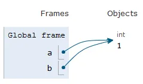
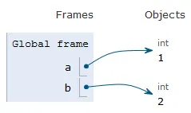

***Everything is an Object - Understanding Pythons Data Model***

Everything is an object. This is the foundation for understanding how variables, memory, types and data manipulation work. Whether handling integers, lists, or a user-defined class, python treats all of them as objects stored in memory, each with a type and an indentifier. 

This article will dive into how python manages objects internally and how mutability, referencing, aliasing, and functions calls work under the hood.

### What is an Object?
An object is a region of memory that contains:

1. a value
2. a type
3. an identifier

Because everything is an object (integers, strings, lists, functions, classes), we are always working with object references rather than raw data. 

### Classes vs Objects
A class is a blueprint for creating objects.
An object instance is a concrete occurence created from a class.
```python
class Dog:
    pass

d1 = Dog() # object instance
d2 = Dog() # another object instance 
```
d1 and d2 share the same class, but they are independent objects that will hold different indentifiers.

### Id() and Type()
id(object) returns the objects identifier
In CPyhton, it is the memory address where the object is stored. <br>
type(object) returns the class of which the object was created
```python
x = 5
print(id(x)) # prints 3857937
print(type(x)) # prints <class 'int'>
```

### Mutable vs Immutable Objects

### Immutable objects: <br>
Objects that can not be changed after creation eg int, float, str, tuple, bytes, forzenset <br>
If an immutable variable is changed, Python will create a new object <br>
Mutable Objects: <br>
Objects that can be changed in place without changing their identity eg list, dict, set, bytearray, user-defined instances.
<br> below is an example of immutable integer assignment. when we place a new value onto 'b', python will create a new int object and make 'b' reference it. 'a' will remain unchanged.
```python
a = 1
b = a
```

```python
b = 2
```


### Mutable Objects: <br>
Changing the list will affect both variables. This happens because lists are mutable and both variables reference the same object
```python
x = [1, 2]
y = x
```
'x' and 'y' now point to the same object.
```python
y.append(3)
```
this change will result in both variables pointing to the appended object
```python
[1, 2, 3] # 'x' and 'y' will both equal the same list
```
<br>

### Assignment vs Referencing

Assignment does not copy objects. It just holds the name or variable to an object in memory.
```python
a = [1, 2]
b = a # an alias not a copy
```
'a' and 'b' reference the same object. <br>
create a true copy:
```python
b = a.copy()
```

#### A Reference is the link between a variable name and the object it points to. 
```python
a = 1 # a is referencing an integer object of 1
```
#### An Alias is when two names or variables refer to the same object
```python
a = [1, 2]
b = a # alias
```
check alias:
```python
a is b # same object: True
a == b # values are equal: True
```

### How Immutable Objects are stored in Memory:
Immutable objects can not change their value. So Python will create a new object in memory. 
```python
x = 10
x = x + 1 # this creates a new object with the value of 11
```

### Integer Preallocation in CPython
CPython pre-creates all integers in the range: <br>
0 to NSMALLPOSINTS - 1 (default=257) <br>
-1 down to -NSMALLNEGINTS (default=5)
<br>
```python
#define NSMALLPOSINTS 257
#define NSMALLNEGINTS 5
```
This is because small integers like 0, 1, 2, are used constantly for loop counters, indexes, boolean conversions, common arithmetic. Preallocating them improves performance and reduces memory usage.
```python
a = 5
b = 5
a is b # true (preallocated)
```
```python
x = 300
y = 300
x is y # false (not preallocated)
```
### Special Cases: Tuples and Frozen Sets
Both are immutable but they can contain mutable objects. The tuple itself can not change but the mutable list inside the tuple, can change. eg:
```python
t = ([1, 2], 3)
t[0].append(4)
print(t)

#prints
([1, 2, 4], 3)
```
Frozen sets behave similarly. You can not add or remove elements from the frozen set itself, but if the frozen set contains a mutable object, its internals could change.

### Passing Variables to Functions
Python uses call-by-assignment. Inside a function, if you pass a mutable object, changes inside the function affect the original object. If you pass an immutable object inside a function, reassignment creates a new object and does not change the original.
```python
def modify_list(List):
    List.append(3)

x = [1, 2]
modify_list(x)
print(x)

#prints
[1, 2, 3]
```
```python
def modify_int(a):
    a = a + 1

x = 5
modify_int(x)
print(x)

#prints
5
```

### In Conclusion
Understanding python's object model provides clarity on how the language behaves under the hood. Every value is an object, every variable is a reference, and mutability affects how data changes in memory. Once you understand the behaviour of a python program, the language becomes more predictable and intuitive.
